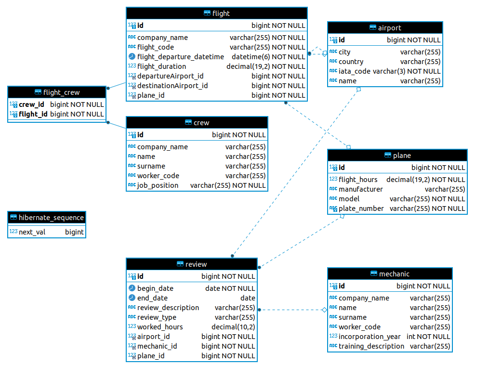

# Práctica 1. Persistencia Relacional.

## Enunciado
Se desea implementar la capa de persistencia para una aplicación de gestión de
mantenimiento de aviones. En particular, se llevará un registro de aviones, vuelos,
tripulantes, aeropuertos, mecánicos y reparaciones realizadas.

La implementación se hará con Java y Spring Data (Java 8) sobre una base de datos
MySQL.

La base de datos gestionará las siguientes entidades, con los datos que se indican para
cada una de ellas:
* Avión: matrícula (tipo String), fabricante, modelo, horas de vuelo.
* Aeropuerto: código IATA (aunque son 3 letras se puede utilizar el tipo String),
  nombre, ciudad, país.
* Tripulante: código de empleado (tipo String), nombre, apellidos, puesto
  (comandante, co-piloto, sobrecargo, ...) y nombre de compañía a la que pertenecen.
* Vuelo: código de vuelo, compañía a la que pertenece, avión que realizó el vuelo,
  aeropuertos de origen y destino, fecha y hora de salida, duración del vuelo (horas
  con decimales). Se desea almacenar además los tripulantes de cada vuelo.
* Mecánico responsable de la revisión: código de empleado (tipo String), nombre,
  apellidos, nombre de la empresa a la que pertenece, año de incorporación a la
  empresa y formación previa (grado, fp, superior, ...).
* Revisión: avión revisado, fecha de inicio, fecha de fin, número de horas empleadas,
  mecánico encargado de la revisión, tipo de revisión (periódica, reparación, ...),
  descripción de trabajos realizados y aeropuerto en que se realizó la revisión.

### Apartado 1: estructura
Se deben crear las correspondientes entidades que modelen este escenario, así como
insertar datos de prueba y proporcionar un código que muestre el correcto almacenamiento
de la información utilizando una clase similar al _DataLoader_ de los ejemplos del curso.

### Apartado 2: consultas
Sobre el escenario anterior se deberán implementar las siguientes consultas, mostrando sus
resultados a través del _DataLoader_. Es necesario que todas las consultas devuelvan algún
resultado:
* Para cada avión, mostrar el nombre y apellidos de los mecánicos responsables de
  sus revisiones.
* Dado el nombre de una ciudad y una fecha, listado de los vuelos que han aterrizado
  (destino) en los aeropuertos de esa ciudad en esa fecha, ordenados por hora.
* Dado el código de empleado de un tripulante, mostrar su nombre y apellidos y las
  ciudades desde las que ha despegado junto con la fecha en que despegó.
* Para cada tripulante, mostrar su nombre y apellidos junto con su número total de
  vuelos y la suma de horas de estos.

### Formato de entrega
La práctica se entregará teniendo en cuenta los siguientes aspectos:
* La práctica se entregará como un fichero .zip que contendrá el proyecto Maven que
  resuelve la práctica.
    * Solamente hay que incluir pom.xml y el directorio src.
    * El proyecto se puede crear con cualquier editor o IDE, pero no se deben incluir
      los ficheros y directorios “de proyecto” del IDE.
* El nombre del fichero .zip será el correo URJC del estudiante (sin
  @alumnos.urjc.es).
* La práctica se entregará por Aula Virtual según la fecha indicada.

Las prácticas se podrán realizar de forma individual o por parejas. En caso de que la
práctica se haga por parejas:
* Sólo será entregada por uno de los alumnos.
* El nombre del fichero .zip contendrá el correo de ambos alumnos separado por
  guión. Por ejemplo p.perezf2019-z.gonzalez2019.zip

## Resolución de la práctica

### Modelo de datos
El modelo de datos tiene la siguiente forma:

## Autor
👤 **Jose Jaime Hernández Ortiz**

* Github: [@zuldare](https://github.com/zuldare)
